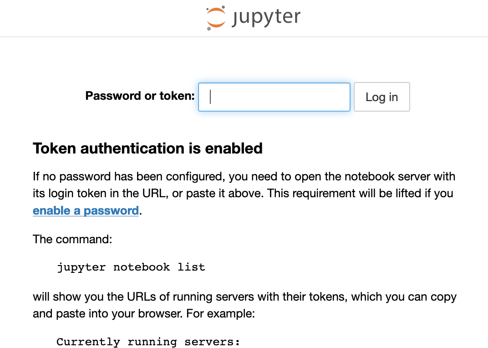

# Using NLP to Detect Keywords

Recognizing keywords is useful for document retrieval and classification. While there are a few ways to go about finding them, this repo will compare Non-negative Matrix Factorization (NMF) and Latent Dirichlet Allocation (LDA) for finding keywords in documents.

## Requirements

This repo is setup to use Docker. Docker installation instruction can be found [here](https://docs.docker.com/install/).

Otherwise a suitable Python environment can be created using the provided `requirements.txt` file.

## Installation with Docker

Download this repository and `cd` into the project directory.

```
$ cd nlp_keyword_detection
```

Then run

```
$ docker-compose build
```

Followed by

```
$ docker-compose up
```

You should see the output:

```
http://(d5e6ec40f4a7 or 127.0.0.1):8888/?token=SUPERLONGHASHThatWillVaryBased0nYourM@ch1ne
```

If you then visit 127.0.0.1:8888 in your browser you'll see the following prompt.



You'll want copy the token that is given to you in the commandline and paste it into the login prompt to access the project.